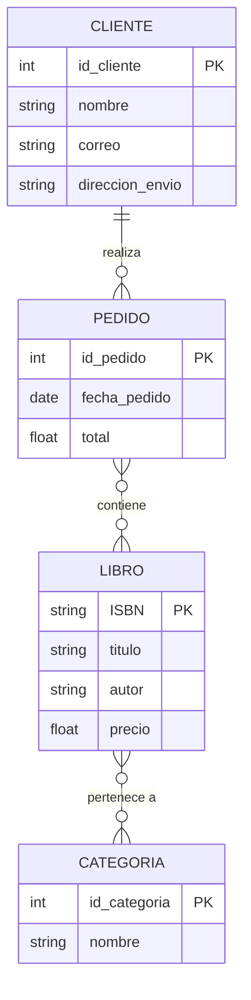

# Diagrama ER 

## Entidades y atributos

- **Cliente**
  - id_cliente (PK)
  - nombre
  - correo
  - direccion_envio

- **Pedido**
  - id_pedido (PK)
  - fecha_pedido
  - total

- **Libro**
  - ISBN (PK)
  - titulo
  - autor
  - precio

- **Categoría**
  - id_categoria (PK)
  - nombre

## Relaciones

- Un **cliente** realiza muchos **pedidos** (1:N).
- Un **pedido** puede incluir muchos **libros** y un **libro** puede estar en muchos pedidos (N:M).
- Un **libro** puede pertenecer a muchas **categorías**, y una **categoría** puede contener muchos libros (N:M).

## Diagrama ER en Mermaid

#Código Mermaid
erDiagram
    CLIENTE {
        int id_cliente PK
        string nombre
        string correo
        string direccion_envio
    }

    PEDIDO {
        int id_pedido PK
        date fecha_pedido
        float total
    }

    LIBRO {
        string ISBN PK
        string titulo
        string autor
        float precio
    }

    CATEGORIA {
        int id_categoria PK
        string nombre
    }

    CLIENTE ||--o{ PEDIDO : "realiza"
    PEDIDO }o--o{ LIBRO : "contiene"
    LIBRO }o--o{ CATEGORIA : "pertenece a"

